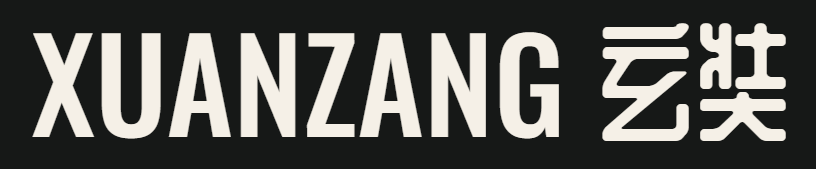

<h1 align="center" id="title"></h1>

<p align="center">
  <a href="https://www.xuan-zang.com/"></a>
  <a href="https://snyk.io/test/github/essteer/xuan-zang"></a>
</p>

<p align="center">
  <a href="https://developer.mozilla.org/en-US/docs/Web/HTML"></a>
  <a href="https://developer.mozilla.org/en-US/docs/Web/CSS"></a>
  <a href="https://developer.mozilla.org/en-US/docs/Web/JavaScript"></a>
  <a href="https://ejs.co/"></a>
  <a href="https://daringfireball.net/projects/markdown/"></a>
  <a href="https://nodejs.org/en"></a>
  <a href="https://vercel.com"></a>
</p>

I built [`XUANZANG`](https://www.xuan-zang.com) as an ongoing project to introduce Chinese-language writers and podcasts, and share information on where to find physical books, Chinese-supported podcast platforms, and related resources.

This is and was my first effort at developing a public-facing website, and makes use of standard HTML and CSS tools. A less conventional component is the use of Embedded JavaScript, a templating tool that enables JavaScript to be written directly into HTML. More recently I've experimented with rendering content from Markdown pages as well.

The site previously relied heavily on Bootstrap, but over time this is being removed in favour of custom content. I tend to prefer to learn the fundamentals rather than rely on frameworks, but otherwise Bootstrap was a good entrypoint to creating the initial design.

## Contents

- [Development](#development)
  - [Installation](#installation)
  - [Operation](#operation)
- [Deployment](#deployment)
- [Content](#content)
  - [Fonts](#fonts)
  - [Writing](#writing)
- [Acknowledgements](#acknowledgements)

## Development

### Installation

[](https://github.com/essteer/xuan-zang)

Clone the repo from GitHub:

```console
$ git clone git@github.com:essteer/xuan-zang
```

Navigate to the root directory and install the packages using `npm`:

```console
$ cd xuan-zang
$ npm install
```

### Operation

[](https://nodejs.org/en)

To run on a local machine for local development, navigate to the root directory and run:

```console
$ npx nodemon index.js
[nodemon] 3.1.3
[nodemon] to restart at any time, enter `rs`
[nodemon] watching path(s): *.*
[nodemon] watching extensions: js,mjs,cjs,json
[nodemon] starting `node index.js`
Serving on port 3000
```

`nodemon` is used to render changes made during development without needing to re-launch the server.

<h3 align="center">
  <a href="#title"></a>
</h3>

## Deployment

[](https://github.com/essteer/xuan-zang)
[](https://vercel.com)

The website is deployed via [Vercel](https://vercel.com/) using a `CI/CD` workflow integrated with the GitHub repository.

A major benefit of integrating with `Vercel` in this way is the ability to view preview deployments from pull requests.

Basic settings for `Vercel` are contained in `vercel.json` in the project root.

<h3 align="center">
  <a href="#title"></a>
</h3>

## Content

Notes on the website content and frontend decisions.

### Fonts

[](https://fonts.google.com/)

The site uses [Google Fonts](https://fonts.google.com/) for title text (`Oswald`: Latin script | `ZCOOL QingKe HuangYou`: Chinese script) and body text (`Source Serif Pro`: Latin script | `Noto Serif TC`: Chinese script).

`ZCOOL QingKe HuangYou` is primarily designed for simplified Chinese character sets, though it contains traditional variants for most &mdash; but not all &mdash; characters.

[`XUANZANG`](https://www.xuan-zang.com) makes use of traditional characters, most of which are featured in `ZCOOL QingKe HuangYou`. There are a small number of exceptions for which I have had to make use of simplified variants. This isn't ideal, but I love the design of the font and decided it is worth the trade-off. Purists please 諒解 - or better yet, release more fonts! There aren't enough creative designs for Chinese scripts.

#### Optimisation

To optimise use of web fonts, practices have been adopted from [CSS Wizardy](https://csswizardry.com/2020/05/the-fastest-google-fonts/)'s additive method:

- `&display=swap` at the end of the href link is now default with Google Fonts - this allows the system font to load if there is a delay in fetching the web font.
- `media="print"` to fetch Google Fonts File asynchronously.
- Preload the CSS file to make the asynchronous fetch high priority.
- Preconnect fonts.gstatic.com, disabling the default fonts.googleapis.com preconnect.
- A `noscript` fallback is also included for instances where JavaScript is disabled.

### Images

[](https://cloudinary.com)

Images are hosted on [Cloudinary](https://cloudinary.com/), and include artworks, photographs, official logos and so on.

Attributions are explicit and I have sought permission from owners to use their images &mdash; many have kindly granted this permission, but if you are the author of content here that you would like to be removed or amended, please contact me directly on [elliott@xuan-zang.com](elliott@xuan-zang.com).

### Writing

All text-based content is my own unless otherwise indicated. The core of the website is organised as follows:

| Section    | Description                                      |
| ---------- | ------------------------------------------------ |
| 墨 INK     | Introductions to writers and books               |
| 嗓 VOICE   | Introductions to podcast series                  |
| 源 SOURCES | Where to get hold of content and study materials |

More content will be added to these sections over time, with new sections also planned - watch this space!

<h3 align="center">
  <a href="#title"></a>
</h3>

## Acknowledgements

[](https://www.udemy.com/course/the-web-developer-bootcamp/)

I learnt many of the skills needed to build this website by completing [Colt Steele's](https://www.youtube.com/channel/UCrqAGUPPMOdo0jfQ6grikZw) excellent [Web Developer Bootcamp](https://www.udemy.com/course/the-web-developer-bootcamp/) on Udemy.

<h3 align="center">
  <a href="#title"></a>
</h3>